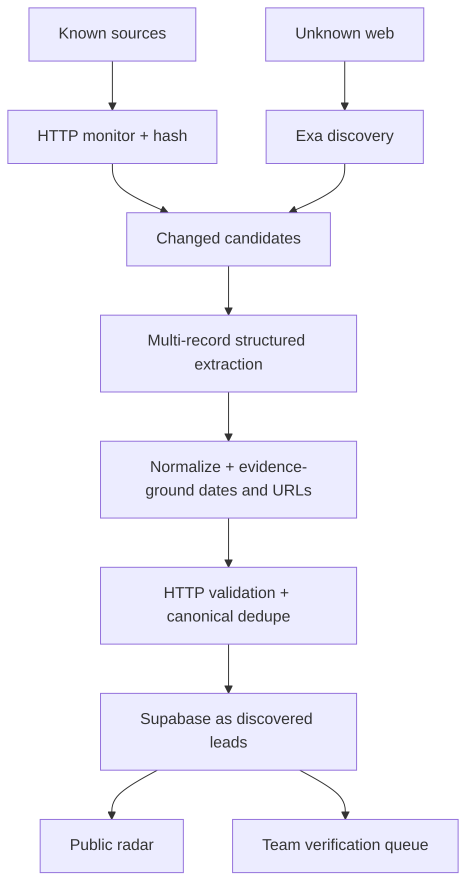

# CineRadar

CineRadar is a public opportunity radar for filmmakers working with AI and emerging media. It discovers, verifies and organizes film festivals, platform contests, grants, residencies and advertising competitions.

The repository contains both the product and its acquisition pipeline:

- public searchable radar with filters, source confidence and deadline sorting;
- device-local saves, plus an authenticated team verification room;
- demo mode that works without external services;
- Supabase schema for live records, known sources and run history;
- Exa discovery workflow for unknown sources;
- direct HTTP monitoring for known sources;
- Cloudflare Workers AI first, Groq fallback, for structured extraction;
- scheduled GitHub Actions for discovery and monitoring;
- strict run limits so cost grows with useful candidates, not monitored pages.

## Quick start

Requirements: Node.js 22+ and pnpm.

```bash
pnpm install
pnpm dev
```

Open the URL printed by the development server. With no environment variables the app intentionally uses eight synthetic demo records.

## Production setup

1. Create a Supabase project and run [`supabase/schema.sql`](supabase/schema.sql) in its SQL editor.
2. Copy `.env.example` to `.env.local` and add the Supabase values.
3. Configure one LLM provider: Cloudflare Workers AI is preferred; Groq is the fallback.
4. Add an Exa key for web discovery.
5. For an existing installation, apply the SQL files in `supabase/migrations/` in filename order. New installations can use `supabase/schema.sql` directly.
6. Run `pnpm radar:seed-sources`, then `pnpm radar:discover` and `pnpm radar:monitor` once.
7. Run `pnpm radar:audit` and review every automated lead in `/team` before changing its status to a public one.
8. Add the same values as deployment variables and GitHub Actions secrets.
9. Deploy the app and enable the two included workflows.

The detailed Codex handoff is in [`CODEX_SETUP.md`](CODEX_SETUP.md). A ready-to-paste setup prompt is in [`codex-setup.prompt.md`](codex-setup.prompt.md).

## Commands

| Command | Purpose |
|---|---|
| `pnpm dev` | Start the web app locally |
| `pnpm build` | Build the Cloudflare-compatible app |
| `pnpm lint` | Run static lint checks |
| `pnpm typecheck` | Run the TypeScript compiler without emitting files |
| `pnpm test` | Run the pipeline and pagination regression tests |
| `pnpm verify` | Run lint, typecheck, tests and a production build |
| `pnpm radar:seed-sources` | Add the initial known-source list |
| `pnpm radar:discover` | Run semantic discovery through Exa |
| `pnpm radar:monitor` | Check known sources and process changed pages |
| `pnpm radar:audit` | Print exact database, link, duplicate and public-visibility counts |

## Data flow



## Cost guardrails

- `DISCOVERY_QUERY_LIMIT` caps Exa queries per run.
- `DISCOVERY_RESULT_LIMIT` caps candidates per query.
- `MAX_LLM_CALLS_PER_RUN` is a hard extraction ceiling.
- `LLM_CONCURRENCY` and `URL_VALIDATION_CONCURRENCY` bound parallel network work.
- `MONITOR_LINK_LIMIT` bounds detail pages followed from each monitored source.
- Known-source monitoring hashes pages before sending changed content to an LLM.
- Provider selection is Cloudflare Workers AI, then Groq.
- The public UI only reads precomputed database records; it never performs live search on page load.

## Security model

- Supabase service keys are server-only and must never use the `NEXT_PUBLIC_` prefix.
- `/api/ingest` requires `INGEST_SECRET`.
- Public database access is read-only and limited by row-level security.
- The team route uses the hosting platform's ChatGPT sign-in flow.
- Automated leads remain `signal` or `discovered` until human verification; the pipeline never auto-publishes them.
- Source, official and application URLs are separate fields. Only HTTP-verified official/application links are rendered as those actions.
- Redirect targets and HTTP status metadata are retained, while 404/410, persistent 5xx, malformed and unsafe URLs are rejected or marked unreachable.
- Deadlines are stored as `confirmed`, `estimated`, `rolling` or `unknown`; ambiguous dates stay unknown.

## Pagination and review

The public catalogue is read from Supabase in bounded pages (24 by default, 50 maximum) and the UI appends pages with **Load more**. Search, filters and sorting are performed server-side, so the first response is not a hidden catalogue cap. If Supabase is configured but unavailable or empty, the app does not substitute demo opportunities. Demo records are used only when public Supabase configuration is absent.

Public row-level security remains the publication boundary. A discovered record becomes visible only after an authenticated reviewer changes it to an allowed public status. The `/team` queue uses server-only service credentials and shows source, official and application links independently.

## Reproducible data bootstrap

1. Apply `supabase/schema.sql` for a new database, or `supabase/migrations/202609220001_opportunity_integrity_and_audit.sql` for the existing schema.
2. Configure `.env.local`; the radar scripts load it automatically. Never commit that file.
3. Run `pnpm radar:seed-sources` to upsert the versioned source catalogue, including explicit Athens, Greece anchors and same-name US disambiguation controls.
4. Run discovery and monitoring. Each run logs discovered, fetched, parsed, validated, duplicate, rejected and stored counters plus rejection reasons.
5. Run `pnpm radar:audit` to capture TOTAL, status/date buckets, URL health, duplicate candidates and anonymous website visibility.
6. Review leads in `/team`; publish only after checking the source and factual fields.

## Important folders

- `app/` — product routes and APIs
- `components/cineradar/` — radar interface
- `lib/server/` — data access and demo fallback
- `scripts/cineradar/` — discovery, monitoring and extraction pipeline
- `supabase/` — database schema
- `.github/workflows/` — scheduled jobs

## Notes

The records in `lib/demo-data.ts` are synthetic and explicitly displayed as demo data. Replace them by configuring Supabase; do not publish them as real opportunities.
