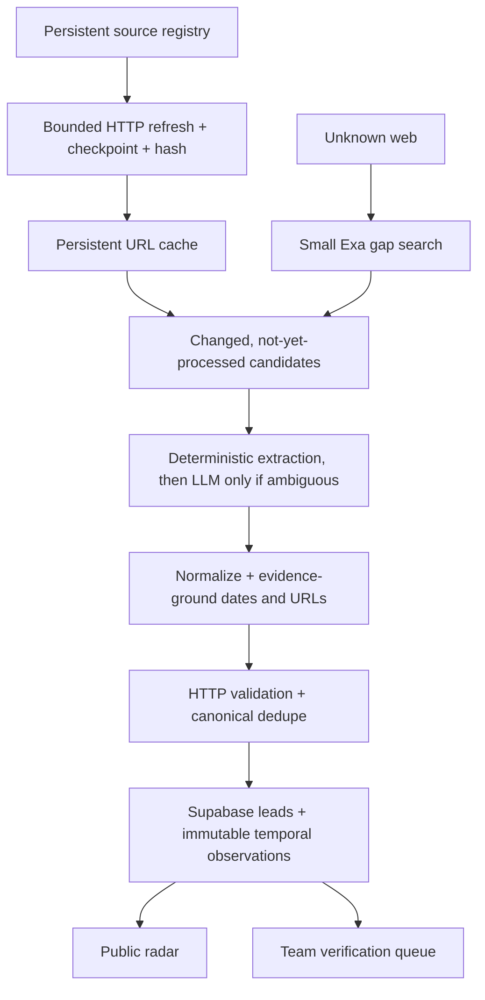

# CineRadar

CineRadar is a public opportunity radar for filmmakers working with AI and emerging media. It discovers, verifies and organizes film festivals, platform contests, grants, residencies and advertising competitions.

The repository contains both the product and its acquisition pipeline:

- public searchable radar with filters, source confidence and deadline sorting;
- device-local saves, plus an authenticated team verification room;
- demo mode that works without external services;
- Supabase schema for live records, known sources and run history;
- persistent, incremental source registry; direct HTTP and content hashes are the primary discovery path;
- a small, rotating Exa gap search for unknown sources, geographies and short-lived calls;
- Cloudflare Workers AI for structured extraction; Groq is opt-in and disabled by default;
- persistent provider usage, source attribution and cross-run URL hashes;
- five GitHub Actions workflow definitions for discovery, monitoring, revalidation, stale checks and slow historical backfill;
- strict run limits so cost grows with useful candidates, not monitored pages.

## Quick start

Requirements: Node.js 22+ and pnpm.

```bash
pnpm install
pnpm dev
```

Open the URL printed by the development server. With no environment variables the app intentionally uses eight synthetic demo records.

## Production setup

1. Create a Supabase project and run [`supabase/schema.sql`](supabase/schema.sql) in its SQL editor. Apply all files in `supabase/migrations/` in filename order, including the source-registry and temporal migrations.
2. Copy `.env.example` to `.env.local` and add the Supabase values.
3. Configure Cloudflare Workers AI. Groq is optional, explicit and disabled by default.
4. Add an Exa key for web discovery.
5. Run `pnpm radar:backfill-integrity` and verify there are no null canonical keys. Existing installations must apply the same migrations; `schema.sql` alone is not enough for the current pipeline.
6. Run `pnpm radar:seed-sources`, `pnpm radar:monitor`, then `pnpm radar:discover` once. Acquisition fails before paid calls until the registry, cost ledger and temporal schema are verified.
7. Run `pnpm radar:audit` and review every automated lead in `/team`. Publication requires an authorized human to set a public status, record verification, and clear `review_required`.
8. Add the same values as deployment variables and GitHub Actions secrets.
9. Deploy the app and enable the five included workflows only after bounded manual smoke runs succeed. The current ChatGPT Sites remote does not execute GitHub Actions.

The detailed Codex handoff is in [`CODEX_SETUP.md`](CODEX_SETUP.md). A ready-to-paste setup prompt is in [`codex-setup.prompt.md`](codex-setup.prompt.md).

## Commands

| Command | Purpose |
|---|---|
| `pnpm dev` | Start the web app locally |
| `pnpm build` | Build the Cloudflare-compatible app |
| `pnpm lint` | Run static lint checks |
| `pnpm typecheck` | Run the TypeScript compiler without emitting files |
| `pnpm test` | Run the pipeline and pagination regression tests |
| `pnpm verify` | Run lint, typecheck, tests and a production build |
| `pnpm radar:seed-sources` | Add the initial known-source list |
| `pnpm radar:discover` | Process changed known-source pages first, then a small Exa gap search |
| `pnpm radar:monitor` | Refresh known sources and child-page hashes without an LLM |
| `pnpm radar:revalidate` | Revalidate stored URLs without an LLM |
| `pnpm radar:stale` | Report stale/historical review candidates without changing status |
| `pnpm radar:audit` | Print exact database, link, duplicate and public-visibility counts |
| `pnpm radar:cost-report` | Print real monthly provider counters and bounded 1x/2x/5x/10x projections |
| `pnpm radar:backfill-integrity` | Backfill and verify canonical keys after the integrity migration |
| `pnpm radar:history` | Bounded historical source backfill from 2023; no forecasting |
| `pnpm radar:benchmark` | Read-only workbook evaluation after discovery; never seeds production |

## Data flow



## Cost guardrails

- `DISCOVERY_QUERY_LIMIT` caps Exa queries per run.
- `DISCOVERY_RESULT_LIMIT` caps candidates per query.
- `MAX_LLM_CALLS_PER_RUN` is a hard extraction ceiling.
- `LLM_CONCURRENCY` and `URL_VALIDATION_CONCURRENCY` bound parallel network work.
- `MONITOR_LINK_LIMIT` bounds detail pages followed from each monitored source.
- `MONTHLY_TARGET_EUR=3` reduces acquisition, `OPTIONAL_STOP_EUR=4` stops optional calls, and `MONTHLY_BUDGET_EUR` is clamped to a hard maximum of EUR 5 for metered providers.
- Every Exa/LLM request reserves budget atomically before dispatch and persists actual or conservatively estimated usage.
- At EUR 3, query/result/LLM ceilings shrink; at EUR 4, optional paid calls stop; at EUR 5, all paid calls stop while free HTTP monitoring and the website continue.
- Known-source refresh only performs normal HTTP and hashes. Its bounded child-page window rotates between runs; changed content is processed later inside the single daily discovery budget.
- Cross-run hashes skip unchanged URLs before the LLM, and query/URL deduplication happens before extraction.
- Cloudflare Workers AI is the primary extractor. Groq requires `GROQ_FALLBACK_ENABLED=true` and is never invoked after a Cloudflare request was dispatched.
- The public UI only reads precomputed database records; it never performs live search on page load.
- The EUR 5 reservation ceiling covers CineRadar's metered provider requests, not provider invoices, price changes, Supabase/hosting plans, or an existing ChatGPT subscription. Confirm provider-side limits and actual bills before asserting an all-in EUR 10/month ceiling.

## Free automation mirror

The configured `origin` is a ChatGPT Sites remote, so GitHub Actions cannot run there. The minimum viable scheduler is a free GitHub repository used as a mirror:

1. Push `main` to a private GitHub repository (or a public one only if the source is intended to be public).
2. Add the server-side secrets listed in `CODEX_SETUP.md`; never copy `.env.local` into the repository.
3. Keep the GitHub Actions spending limit at zero and manually run each workflow once after the Supabase migrations and backfill pass.
4. Enable the five schedules only after the manual smoke runs succeed. They share one concurrency group and use bounded jobs. A local Task Scheduler job is the immediate EUR 0 alternative if a GitHub mirror is unavailable.

No paid scheduler is required. Account-wide GitHub quota consumption still needs monitoring because the free allowance is shared with other private repositories.

ChatGPT Sites itself is included only with an [eligible ChatGPT plan](https://learn.chatgpt.com/docs/sites). If that subscription must count within the EUR 10 total, the current hosting arrangement cannot be certified against the budget; if it is an existing sunk subscription, assess the incremental CineRadar spend separately.

## Security model

- Supabase service keys are server-only and must never use the `NEXT_PUBLIC_` prefix.
- `/api/ingest` requires `INGEST_SECRET`.
- Public database access is read-only and limited by row-level security.
- The team route uses ChatGPT sign-in plus a server-side exact-email allowlist (`CINERADAR_TEAM_EMAILS`). If the allowlist is unset, access fails closed.
- Automated leads are inserted with `review_required=true`. Source-observed `open`/`closed` claims may update temporal status but cannot pass public RLS until an authorized human clears the review flag.
- Source, official and application URLs are separate fields. Only HTTP-verified official/application links are rendered as those actions.
- Redirect targets and HTTP status metadata are retained, while 404/410, persistent 5xx, malformed and unsafe URLs are rejected or marked unreachable.
- Deadlines are stored as `confirmed`, `estimated`, `rolling` or `unknown`; ambiguous dates stay unknown.

## Pagination and review

The public catalogue is read from Supabase in bounded pages (24 by default, 50 maximum) and the UI appends pages with **Load more**. Search, filters and sorting are performed server-side, so the first response is not a hidden catalogue cap. If Supabase is configured but unavailable or empty, the app does not substitute demo opportunities. Demo records are used only when public Supabase configuration is absent.

Public row-level security remains the publication boundary. A discovered record becomes visible only after an authenticated reviewer changes it to an allowed public status; temporal conflicts set `review_required` and hide the row again until reviewed. The `/team` queue uses server-only service credentials and shows source, official and application links independently.

## Reproducible data bootstrap

1. Apply `supabase/schema.sql` for a new database, then all migrations in filename order; for an existing database apply all pending migrations. Run `pnpm radar:backfill-integrity`.
2. Configure `.env.local`; the radar scripts load it automatically. Never commit that file.
3. Run `pnpm radar:seed-sources` to upsert the versioned source catalogue, including explicit Athens, Greece anchors and same-name US disambiguation controls.
4. Run the HTTP/hash source refresh, then discovery. Each run logs discovered, fetched, parsed, validated, duplicate, rejected, unchanged and stored counters plus rejection reasons. Provider usage, source economics, provenance and temporal observations are stored in service-only tables.
5. Run `pnpm radar:audit` to capture TOTAL, status/date buckets, URL health, duplicate candidates and anonymous website visibility.
6. Review leads in `/team`; publish only after checking the source and factual fields, setting `verified_at`, and clearing `review_required` through an authorized database workflow. The current team page is read-only.

The supplied research workbook is strictly a read-only regression benchmark. Set `CINERADAR_BENCHMARK_WORKBOOK` to its local path, then run `pnpm radar:benchmark`. It compares stored discoveries conservatively and reports train/holdout recall; it never inserts workbook rows or feeds their names into discovery. Passing local tests does not establish live recall.

Current deployment note (2026-09-25): the first four migrations and `202609250001_human_review_gate.sql` were applied to live Supabase. The `review_required` database default is `true`; all 42 existing records require review and none are visible to anonymous clients. Bounded source monitoring, discovery, revalidation, stale checks, provider counters, and benchmark runs succeeded. Keep unattended scheduling off until the deployed version passes production smoke checks. The ChatGPT Sites remote does not run GitHub Actions.

## Important folders

- `app/` — product routes and APIs
- `components/cineradar/` — radar interface
- `lib/server/` — data access and demo fallback
- `scripts/cineradar/` — discovery, monitoring and extraction pipeline
- `supabase/` — database schema
- `.github/workflows/` — scheduled jobs

## Notes

The records in `lib/demo-data.ts` are synthetic and explicitly displayed as demo data. Replace them by configuring Supabase; do not publish them as real opportunities.
